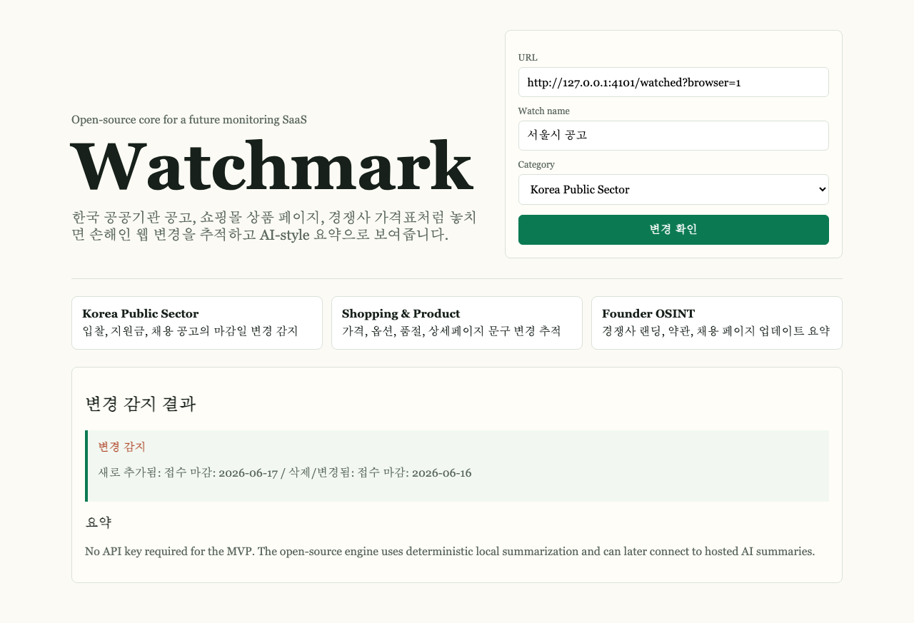

# Watchmark

[한국어 README](README.md)

Watchmark is an open-source website change monitor for pages where missing an update costs time or money: Korean public-sector notices, grant deadlines, shopping/product pages, competitor pricing, hiring pages, and policy pages.

It stores a baseline, extracts meaningful text, filters common boilerplate, and summarizes what changed in plain language. The MVP runs locally without an API key. The same core can grow into a hosted SaaS with scheduled checks, team alerts, public site templates, and optional AI summaries.



## Why It Matters

- Public notices in Korea: bids, subsidies, hiring, deadlines, and attachment changes.
- Shopping operations: price, stock, option, coupon, and product-detail copy changes.
- Founder and sales research: competitor landing pages, pricing, terms, and job postings.
- Personal monitoring: keep a change history without repeatedly refreshing pages.

## MVP Features

- Register or re-check a URL with `POST /api/check`.
- Store the first check as the baseline snapshot.
- Detect meaningful text changes on later checks.
- Summarize changes locally without requiring an API key.
- Ship a browser dashboard positioned for Korean public-sector and commerce use cases.
- Block private/local network targets by default, including unsafe redirects.
- Run with TypeScript, Bun, Hono, Zod, Biome, and CI-backed tests.

## Quick Start

```bash
bun install
bun run dev
```

Open `http://localhost:3000/watch`.

API example:

```bash
curl -i -X POST http://localhost:3000/api/check \
  -H 'content-type: application/json' \
  -d '{"url":"https://example.com","name":"Example","category":"public"}'
```

## Scripts

```bash
bun test
bun run typecheck
bun run lint
bun run build
```

## Security and Privacy Defaults

- No OpenAI key or other third-party API key is required for the MVP.
- `.env` files and local build/runtime output stay out of git.
- User-provided URLs are blocked from private/local network access by default.
- Redirect targets are validated before each fetch.
- Dashboard output is rendered with DOM text nodes instead of HTML injection.
- Fetch failures return sanitized messages instead of raw exception details.

See [SECURITY.md](SECURITY.md) and [docs/security-review.md](docs/security-review.md).

## Open Source + SaaS Path

The open-source project is the local monitoring engine and dashboard. A hosted product can add:

- Scheduled checks and longer history retention.
- Email, Slack, Discord, KakaoTalk, and webhook alerts.
- Team workspaces, watch limits, and paid plans.
- Optional OpenAI-powered summaries for dense Korean notices and product pages.
- Public templates for government sites, shopping malls, and competitor pages.

## Maintainer Workflow

- CI runs lint, typecheck, tests, and build on pull requests.
- Issue templates collect bug reports, feature requests, and public site-template requests.
- `ROADMAP.md`, `CHANGELOG.md`, `SECURITY.md`, and `CONTRIBUTING.md` make the maintenance path visible.
- `docs/backlog.md` lists the first public issues to seed the project after launch.

## Codex for Open Source Fit

Watchmark is designed as a real OSS project that benefits from Codex: issue triage, PR review, release workflows, scraper hardening, and regression test generation for many website shapes. See [application/codex-for-oss-draft.md](application/codex-for-oss-draft.md).

## License

MIT. See [LICENSE](LICENSE).
